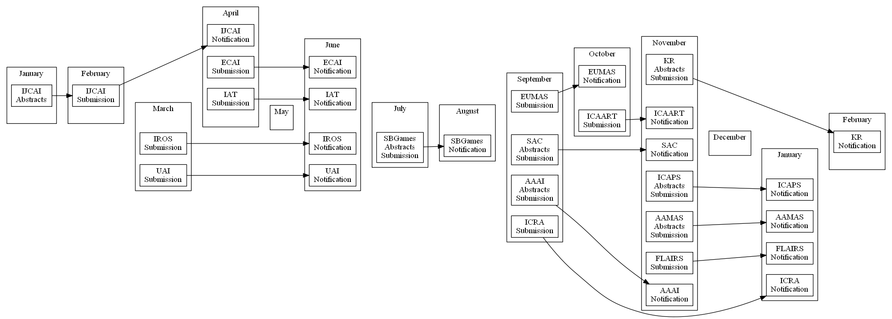

# Timeline
**Convert Markdown timeline to Graphviz DOT**



The Ruby program converts parts of the Markdown to Graphviz DOT.
Each ``[]:`` into a link, ``##`` into a cluster, ``-`` of the cluster into a node.
Links and descriptions must be described before the actual input starts.
This README is actually a valid input, see the raw file to see the links.
In order to take full advantage of links and tooltips we recommend SVG output (currently not supported by GitHub Markdown), see the result [here](http://maumagnaguagno.github.io/Timeline).

```Shell
ruby timeline.rb README.md LR                   # Generate Left to Right DOT file
..\graphviz\bin\dot.exe README.md.dot -O -T svg # Generate SVG file
```

[IJCAI]: http://www.ijcai.org/ "International Joint Conference on Artificial Intelligence"
[UAI]: http://auai.org/uai2017/index.php "Conference on Uncertainty in Artificial Intelligence"
[IROS]: http://www.iros.org/ "International Conference on Intelligent Robots and Systems"
[ECAI]: http://www.ecai2016.org/ "European Conference on Artificial Intelligence"
[IAT]: http://wibih.unomaha.edu/wi "International Conference on Intelligent Agent Technology"
[SBGames]: http://sbgames.org/ "Simposio Brasileiro de Games e Entretenimento Digital"
[ICRA]: http://www.icra2017.org/ "International Conference on Robotics and Automation"
[SAC]: http://www.sigapp.org/sac/ "Symposium On Applied Computing"
[AAAI]: http://www.aaai.org/Conferences/conferences.php "Association for the Advancement of Artificial Intelligence"
[EUMAS]: http://eumas-at2016.webs.upv.es/EUMAS2016.html "European Conference on Multi-Agent Systems"
[ICAART]: http://www.icaart.org/ "International Conference on Agents and Artificial Intelligence"
[ICAPS]: http://www.icaps-conference.org/ "International Conference on Automated Planning and Scheduling"
[AAMAS]: http://www.ifaamas.org/ "International Conference on Autonomous Agents and Multiagent Systems"
[FLAIRS]: http://www.flairs.com/ "Florida Artificial Intelligence Research Society"
[KR]: http://www.kr.org/ "International Conference on Principles of Knowledge Representation and Reasoning"

## January
- [IJCAI] Abstracts

## February
- [IJCAI] Submission

## March
- [UAI] Submission
- [IROS] Submission

## April
- [IJCAI] Notification
- [ECAI] Submission
- [IAT] Submission

## May

## June
- [ECAI] Notification
- [IAT] Notification
- [UAI] Notification
- [IROS] Notification

## July
- [SBGames] Abstracts Submission

## August
- [SBGames] Notification

## September
- [ICRA] Submission
- [SAC] Abstracts Submission
- [AAAI] Abstracts Submission
- [EUMAS] Submission

## October
- [EUMAS] Notification
- [ICAART] Submission

## November
- [AAAI] Notification
- [SAC] Notification
- [ICAPS] Abstracts Submission
- [AAMAS] Abstracts Submission
- [KR] Abstracts Submission
- [FLAIRS] Submission
- [ICAART] Notification

## December

## January
- [ICRA] Notification
- [ICAPS] Notification
- [AAMAS] Notification
- [FLAIRS] Notification

## February
- [KR] Notification
