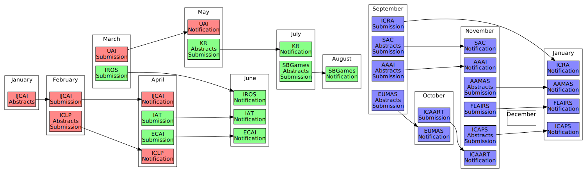

# Timeline
**Convert Markdown timeline to Graphviz DOT**



Timeline converts parts of Markdown to Graphviz [DOT](https://en.wikipedia.org/wiki/DOT_%28graph_description_language%29 "Graph description language"):
- ``[node]: http://www.website.com "optional tooltip"`` to a node external link
- ``## cluster`` to a cluster
- ``- [node] description`` to a node of the cluster

Node external links are optional, but are expected to be defined before their respective nodes appear.
Edges between nodes of the same cluster are possible.
Nodes defined before the first cluster are considered free.
This README is actually a valid input, open the [raw](https://raw.githubusercontent.com/Maumagnaguagno/Timeline/master/README.md) file to see the links.

There are two implementations available.
The first one in Ruby reads a Markdown file and direction, ``README.md`` and ``LR`` by default, and outputs a DOT file.
This DOT file contains a graph representation of the timeline, which can be converted into an image format by Graphviz.
By using a combination of a HTML and SVG output one can obtain a static timeline page.
SVG output is recommended to take full advantage of links and tooltips, see the result [here](http://maumagnaguagno.github.io/Timeline/static.html).

```Shell
ruby timeline.rb README.md LR                   # Generate Left to Right DOT file
..\graphviz\bin\dot.exe README.md.dot -O -T svg # Generate SVG file
```

The second one is implemented in JavaScript and focuses on client-side rendering within the browser.
This removes the need to install any specific tools, while adding interactivity.
This version is able to read a Markdown file from an URL, edit, display and download their content and graph, see the result [here](http://maumagnaguagno.github.io/Timeline).

```
http://maumagnaguagno.github.io/Timeline?from=https://raw.githubusercontent.com/username/project/master/README.md
```

[IJCAI]: http://www.ijcai.org/ "International Joint Conference on Artificial Intelligence"
[UAI]: http://auai.org/ "Conference on Uncertainty in Artificial Intelligence"
[IROS]: http://www.iros.org/ "International Conference on Intelligent Robots and Systems"
[ECAI]: https://www.ijcai-18.org/ "European Conference on Artificial Intelligence"
[IAT]: http://wibih.unomaha.edu/wi "International Conference on Intelligent Agent Technology"
[SBGames]: http://sbgames.org/ "Simposio Brasileiro de Games e Entretenimento Digital"
[ICRA]: http://www.icra2018.org/ "International Conference on Robotics and Automation"
[SAC]: http://www.sigapp.org/sac/ "Symposium On Applied Computing"
[AAAI]: http://www.aaai.org/Conferences/conferences.php "Association for the Advancement of Artificial Intelligence"
[EUMAS]: https://eumas2017.ibisc.univ-evry.fr/ "European Conference on Multi-Agent Systems"
[ICAART]: http://www.icaart.org/ "International Conference on Agents and Artificial Intelligence"
[ICAPS]: http://www.icaps-conference.org/ "International Conference on Automated Planning and Scheduling"
[AAMAS]: http://www.ifaamas.org/ "International Conference on Autonomous Agents and Multiagent Systems"
[FLAIRS]: http://www.flairs.com/ "Florida Artificial Intelligence Research Society"
[KR]: http://www.kr.org/ "International Conference on Principles of Knowledge Representation and Reasoning"
[ICLP]: https://www.cs.nmsu.edu/ALP/iclp2018/ "International Conference on Logic Programming"

## January
- [IJCAI] Abstracts

## February
- [ICLP] Abstracts Submission
- [IJCAI] Submission

## March
- [UAI] Submission
- [IROS] Submission

## April
- [IJCAI] Notification
- [ECAI] Submission
- [IAT] Submission
- [ICLP] Notification

## May
- [KR] Abstracts Submission
- [UAI] Notification

## June
- [ECAI] Notification
- [IAT] Notification
- [IROS] Notification

## July
- [SBGames] Abstracts Submission
- [KR] Notification

## August
- [SBGames] Notification

## September
- [ICRA] Submission
- [SAC] Abstracts Submission
- [AAAI] Abstracts Submission
- [EUMAS] Abstracts Submission

## October
- [EUMAS] Notification
- [ICAART] Submission

## November
- [AAAI] Notification
- [SAC] Notification
- [ICAPS] Abstracts Submission
- [AAMAS] Abstracts Submission
- [FLAIRS] Submission
- [ICAART] Notification

## December

## January
- [ICRA] Notification
- [ICAPS] Notification
- [AAMAS] Notification
- [FLAIRS] Notification